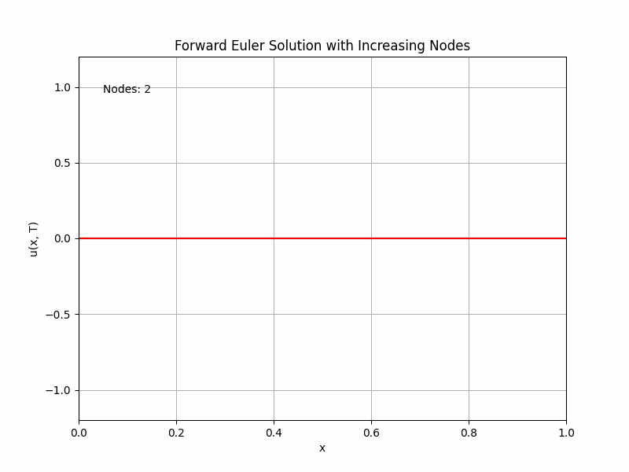
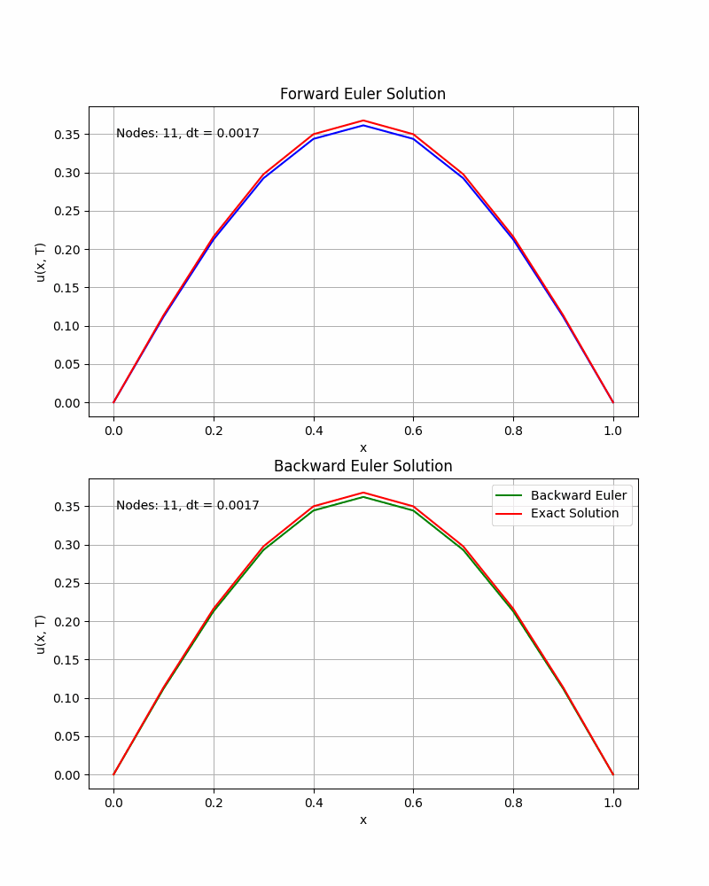

# Galerkin-Method-Solver

# Project 2: Solving a 1D Heat Transfer Problem using the Galerkin Method

## Problem Description
This project involves solving a 1D heat transfer problem with the following form:

### Governing Equation
\[
u_t - u_{xx} = f(x, t), \quad (x, t) \in (0, 1) \times (0, 1)
\]

### Initial and Boundary Conditions
- Initial Condition: 
  \[
  u(x, 0) = \sin(\pi x)
  \]
- Dirichlet Boundary Conditions:
  \[
  u(0, t) = 0, \quad u(1, t) = 0
  \]

### Forcing Function
The forcing function is given as:
\[
f(x, t) = (\pi^2 - 1)e^{-t}\sin(\pi x)
\]

### Analytical Solution
The analytical solution to this problem is:
\[
u(x, t) = e^{-t}\sin(\pi x)
\]

---

## Objectives
1. **Derive the Weak Form:**
   - Express the governing equation in its weak form to allow implementation of the Galerkin method.

2. **Forward Euler Method:**
   - Solve the problem using Forward Euler discretization with an initial time step \(\Delta t = \frac{1}{551}\).
   - Plot the results at the final time.
   - Gradually increase \(\Delta t\) to observe instability and determine the critical time step at which instability occurs.
   - Analyze how the solution changes as the number of spatial nodes \(N\) decreases.

3. **Backward Euler Method:**
   - Solve the same problem using Backward Euler with the same time steps.
   - Observe and explain what happens when \(\Delta t \geq h\), where \(h\) is the spatial step size.

---

## Methodology

### Steps to Implement
1. **Discretization and Weak Form:**
   - Use 1D Lagrange basis functions for spatial discretization.
   - Numerically integrate the weak form using **2nd order Gaussian quadrature** in the parent space \([-1, 1]\).
   - Map the elemental mass and stiffness matrices from parent space to global space.

2. **Time Stepping Methods:**
   - **Forward Euler:**
     \[
     u^{n+1} = u^n + \Delta t \cdot M^{-1} \left(-K u^n + F^n\right)
     \]
   - **Backward Euler:**
     \[
     u^{n+1} = \frac{1}{\Delta t}B^{-1}Mu^{n} + B^{-1}F^{n+1}
     \]

3. **Matrix Assembly:**
   - Build the global stiffness matrix \(K\), mass matrix \(M\), and global forcing vector \(F\).
   - Implement boundary conditions (Dirichlet and Natural) appropriately.

4. **Numerical Solution:**
   - Solve for \(u(x, t)\) at each time step until \(t = 1\).

---

---

## Results and Analysis
Below are the results found for the Forward and Backward Euler implementation with 11 nodes and a $\Delta{t}$ = $\frac{1}{551}$ 

Forward euler hits instability at a time step of approximately 1/540. As the amount of nodal values decreases, the approximation becomes weaker and starts to under approximate along the whole interval. This is showcased by oscillations and divergence of the approximations.

As the backward euler time-step becomes equal or greater than the spatial step size, the method maintains stability but will eventually lose accurace as dt becomes large enough. The lose of accuracy is caused by the numerical diffusion which over-smooths the gradients leading to an overestimation, leading to a lack of the finer details.

